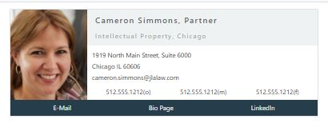
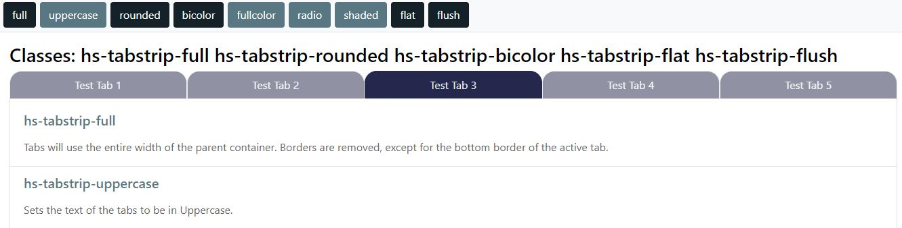
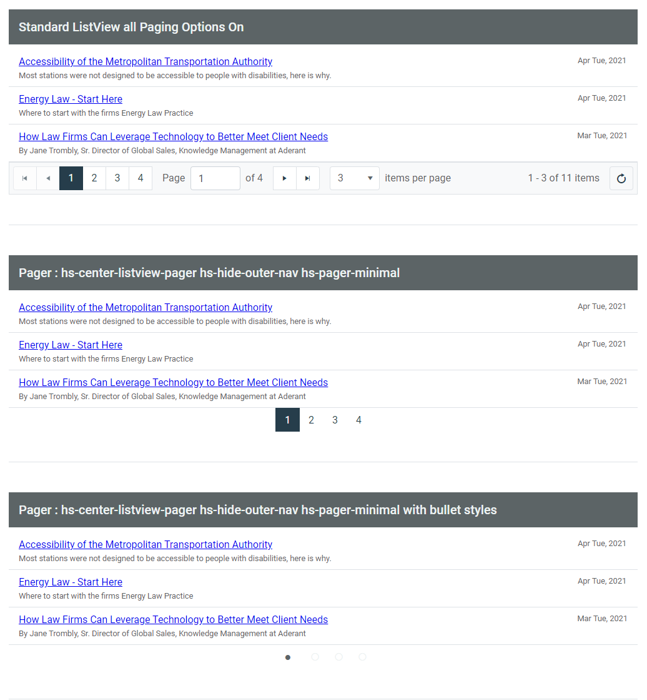
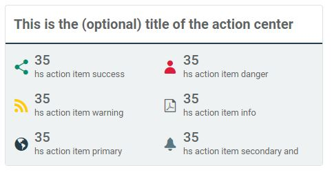

# Handshake CSS Framework Project 2021 <!-- omit in toc -->
Last update April 16 2021

A live demo of this framework can be reviewed [here](https://aderant-handshake.github.io/HSFramework-Public/src/index.html)

## Purpose <!-- omit in toc -->
This project is a ground up rebuild of the Handshake UI Framework that includes SASS modules from: 

* Selected components of Bootstrap 4.5 
* Kendo Bootstrap Theme SASS files
* New CSS created to support general Handshake usages, especially in Connect 2.0

This Framework may be used for any Handshake Installation and Connect is not required. The Build files are available to Handshake customers on request. 

## References <!-- omit in toc -->
Your best references for this framework are: 
* [Bootstrap 4 documentation site](https://getbootstrap.com/docs/4.5/layout/overview/).  
* [Kendo UI for jQuery Styles and Appearance](https://docs.telerik.com/kendo-ui/styles-and-layout/sass-themes)

# Table of Contents <!-- omit in toc -->
- [Modules](#modules)
  - [User Profile Cards](#user-profile-cards)
  - [Kendo Tab Styles](#kendo-tab-styles)
  - [Kendo Listview](#kendo-listview)
    - [ListView Border](#listview-border)
    - [Minimal Pager Style](#minimal-pager-style)
  - [Handshake Layouts](#handshake-layouts)
  - [HS Action Items and Tiles](#hs-action-items-and-tiles)
    - [Tiles](#tiles)
    - [Action Tiles](#action-tiles)
    - [Action Metric Colors](#action-metric-colors)
    - [Action Groupings](#action-groupings)
    - [HTML Markup](#html-markup)
  - [SeeMore](#seemore)
  - [Helpers](#helpers)
    - [Font Icon Helpers](#font-icon-helpers)
- [Bootstrap](#bootstrap)


## Usage
To use this repository to create a new/custom client build 

#### Clone this repository to a local folder 
All you need is the GitHub project folders and files.  You are not required to download, install or use Git unless you intend to check files back into this repository. 

If you do plan on updating this repository, make sure that you understand how to fork the project and create a pull request for the updates. 

#### Setup your machine to support a node.js/gulp build workflow 
Install and configure node.js/gulp if you don't already have it on your build machine:

* Install [node.js](https://nodejs.org/en)
* Launch node.js command prompt, go to local work folder (the local drive/folder where you cloned this repository)
* Run **npm install**:  this will read the packgage.json file and get all the dependencies, including current bootstrap 4 and kendo packages.  These files will be downloaded to node_modules in the working directory.  You never need to upload or transfer this folder. Which is good - while not large it contains almost 10,000 files.
* Run **npm install --global gulp**:  this enables gulp to run directly from the cmd line as a process
* Make your required changes, the run **gulp build** to build the css package, which will create/update 2 files in ./release folder 

```
npm install
npm install --global gulp

gulp build | watch
```
> If you get this error when running npm install  `npm ERR! errono SELF_SIGNED_CERT_IN_CHAIN` then try the command below
```
npm config set strict-ssl false
npm install
```

# Modules 
The framework is broken down into the following modules.

## User Profile Cards 
User Profile Cards provide a number of options for displaying user information.  It is both responsive and declarative.  Meaning, at a "phone" level breakpoint, it will automatically display a compressed view, or your may choose to display the compressed mobile view even on a large screen. 

Them html markup should contain 3-4 areas:

1.  Photo section - designated by the class 'hs-upc-photo', optional if hs-upc-nophoto class is used
2.  Header - designated by the class 'hs-upc-header'
3.  Details - designated by the class 'hs-upc-details'
4.  Footer - designated by the class 'hs-upc-footer'

Sample markup
```html
<div class="hs-upc">
    <div class="hs-upc-photo">
        
    </div>
    <div class="hs-upc-header hs-upc-shade">
        <div class="hs-upc-title">Cameron Simmons, Partner</div>
        <div class="hs-upc-subtitle">Intellectual Property, Chicago</div>
    </div>
    <div class="hs-upc-details">
        <div class="hs-upc-h-group">
            <div>1919 North Main Street, Suite 6000</div>
            <div>Chicago IL 60606</div>
            <div>cameron.simmons@jlalaw.com</div>
        </div>
        <div class="hs-upc-v-group k-mb-2">
            <span class="p-office">512.555.1212(o)</span>
            <span class="p-mobile">512.555.1212(m)</span>
            <span class="p-fax">512.555.1212(f)</span>
        </div>
    </div>
    <div class="hs-upc-footer hs-upc-shade-primary">
        <div class="hs-upc-v-group">
            <span class="k-button k-flat">E-Mail</span>
            <span class="k-button k-flat">Bio Page</span>
            <span class="k-button k-flat">LinkedIn</span>
        </div>
    </div>
</div>
````

Using CSS in your skin, you can also dramatically alter the layout of the components.  For example, this css would create a layout with the header on top, and the photo between the deatils and footer section.  

```css
.hs-upc.hs-upc.my-custom-upc {
    grid-template-areas : "header header header photo" "details details details footer";
    grid-template-columns: 1fr 1fr 1fr 25%
}
```

#### Helper Classes for hs-upc 
In addition to the section classes, the following css can alter the view for specific use-cases. The following class names are pre-fixed by hs-upc- 

*   **shade or shade-[primary | secondary | dark | light]**:  sets the background color of a section.  
*   **h-group, v-group**:  display the content in the section as either a vertical or horizontal list 
*   **stacked**:  sets all sections in a single vertical grid 
*   **compact**:  set the photo and header on top, and puts details and footer stacked beneath, this is also the layout that will be used on small viewport 
*   **title, subtitle** - child elements of the header section, will expand font size and spacing on medium and greater view ports.

> Note: except for **hs-upc-photo**, the content contained in a particular section is arbitrary.  If your use-case doesn't require a section, like a footer, then supply a grid-template-areas rule that leaves that section out.  The photo section expect a photo, if you do not have/need one, then add hs-upc-nophoto class to the root element.

#### User Profile Sample Cards

###### Standard


###### Mobile 


###### Stacked 
 

## Kendo Tab Styles 
The following classes are included to support useful customizations to kendo tabs that use appropriate bootstrap and kendo variables. They are each pre-fixed by hs-tabstrip- 


* **uppercase**: Sets the text of the tabs to be in Uppercase.
* **full**:  Tabs will use the entire width of the parent container. Borders are removed, except for the bottom border of the active tab.
* **bicolor**:  Sets the Active Tab to a background of $tabcolor(a), and all inactive tabs to $tabcolor(b). Text color is set using a function to determine optimim color based on the background-color. A slight box-shadow is set on the active tab.
* **fullcolor**:  Sets the background color of each tab to $tabcolor(a..e), then repeats. The opacity of inactive tabs is $tabcolor(opacity), while the opacity for active and on hover tabs is 1 A slight box-shadow is set on the active tab. 
* **rounded**:  Set a radius to the top left/right corners. Radius is defined in the $tabcolor(radius)
* **radio**:  Renders the tabs as a set of radio control buttons
* **shaded**:  Tabs will use full width of the parent container. Active tab will use $tabcolor(a) as the background. Hover backgroud will be $tabcolor(b).
* **flat**:  Removes any box-shadow that may be set by another class such as hs-tabstrip-fullcolor.
* **flush**:  Removes padding and border of child elements such as a HTML5Grid or a list-group inside an HTML5ListView when it is a direct descendent to the active tab container
* **hs-tabstrip-cleanleft**: Provides a cleaner/minimal vertical-left tab interface. 

> **TIPS** Many of these classes may be combined like fullwidth & fullcolor, but not all will make sense like fullcolor and bicolor. For consistency in your site, you may elect to use and Application Option variable to define on or more class name that may be used in the skin.
 
```xml
<html5tabstrip class="{tabstrip}" ...>
```
where tabstrip = "hs-tabstrip-fullwidth hs-tabstrip-uppercase" in the Application Options Table

##### Tabstrip Sample
  


## Kendo Listview
With Kendo build v2020.2.513, which is included with Handshake 3.9.5 kendo fixed an inconsistency in the listview structure by adding a "middle" element between the listview parent node, and the individual list items. 

This means that a class name that is used to control direct decedents, like flex and grid, are added to HTML5ListView class list, it will not be applied to the list items as expected. 

#### Work around 
This has been resolved by the dev team by **moving** any classnames or styles applied to the HTML5ListView Element a level down to the k-listview-content element. There is one use case where this does not produce the desired result, and that is when you do need to apply a classname/style to the HTML5ListView Element.  In this case you would need to apply a classname to the HTML5ListView container, and construct your css to act on the child element (the HTML5ListView) of that container. 

### ListView Border
Standard OOTB kendo ListView behavior adds a border to the kendo listview element. It almost every use case in Connect this ends up a producing an undersireable double-border effect. 

Rather than turning it off 95% of the time, the default behavior has been changed in this framework to remove the border.   If you need an HTLM5ListView element to have a border, apply **hs-listview-border** class to the parent container of the HTM5ListView element. 

### Minimal Pager Style
This Framework along with templates included in Connect 2.0 provide a minimal bulleted listview pager control.

HCP20-PagerSelectTemplate
```xml
<li class="hs-listview-bullet-pager"><a tabindex="-1" href="\#" class="k-link hs-inactivelink"><span class="k-state-selected"><i class="k-icon k-i-circle"></i></span></a></li>
```

```xml
<li class="hs-listview-bullet-pager">
    <a tabindex="-1" href="\#" class="k-link" data-page="#:text#">
        <i class="k-icon k-i-shape-circle"></i>
    </a>
</li>
```

#### Classes to produce a minimal page style
Apply these to get a minimal / bulleted list view pager. These classes must be applied to the parent div of the HTML5ListView element.
- hs-center-listview-pager 
- hs-hide-outer-nav 
- hs-pager-minimal

#### Samples


## Handshake Layouts
This framework provides a number of pre-defined layout options.  They are built using CSS Display Grids.  The Bootstrap Responsive Grid Framework is not included in this build, and every effort has been made with these layout to mitigate that. 

All layouts are responsive, in that on mobile devices that will appear as stacked elements. 

CSS Grids are the most straight forward way to construct page layouts, if you have a complex custom use case it is not difficult to build that in the skin with appropriate CSS.  [css-tricks](https://css-tricks.com/snippets/css/complete-guide-grid/)  is an excellent resource if you are just starting with CSS grid.

Supplied Layout Classes are:
-   hs-grid-magazine
-   hs-grid
-   hs-grid-[ double | triple | quad ]
-   hs-grid-84split
-   hs-grid-48split


## HS Action Items and Tiles

### Tiles
Tiles display child elements in a boxed container.   Elements will be spaced and centered evenly in the container.  

You may use hs-tile as a standalone container or grouped in a grid using hs-tile-grid. 

Tiles may be small, medium or large.

* hs-tile-sm : 150px * 0.75
* hs-tile    : 150px
* hs-tile-lg : 150px * 1.50

Use hs-tile-grid-sm or hs-tile-grid-lg to affect all tiles in the grid container. 

All Bootstrap Color Theme names are available to control the color of the tile

*   Primary
*   Secondary
*   Info (default)
*   Success
*   Warning
*   Danger
*   Dark 
*   Light

To set the color use the class hs-tile-grid-{themecolor} or hs-tile-{themecolor}

#### Basic Markup for Container Tiles 
```html
<div class="hs-tile-grid">
    <div class="hs-tile" onclick="someaction();">
        <div>Some Title</div>
        <div><span class="k-icon k-i-image k-icon-xl"></span></div>
    </div>
    <div class="hs-tile" onclick="someaction();">
        <div>Some Other Title</div>
        <div><span class="k-icon k-i-image k-icon-xl"></span></div>
    </div>
</div>
```

### Action Tiles
Action Tiles are a way to present the state of some business activity and a way to act on that state.  This could be conflicts that need to be checked, bills to approve, time entry that is late as examples.

A action item may contain one of more of the following elements:

* Title
* Metric
* Description
* To Do link

> Sample: an action tile

  

### Action Metric Colors
All Bootstrap Color Theme names are available to control the color of the action metric and icon.

*   Primary
*   Secondary
*   Info (default)
*   Success
*   Warning
*   Danger
*   Dark
*   Light

### Action Groupings
Actions may be grouped as:

* A vertical list using the class **hs-action-tiles-list**
* A horizontal list using the class **hs-action-tiles-group**
* A box of smaller action icons in the class **hs-action-tiles-center** 
* A smaller action item using **hs-action-button** will display just a title and a metric. 

> You can add the class hs-action-sugar to the top level grouping for 

> Sample: an action center

  

### HTML Markup
Below are some sample markups, which can be see in the [live demo site.](https://smchargue.github.io/HSFramework/src/actiontiles.html)

```html
<div class="hs-action-tile hs-action-danger">
    <div class="hs-action-header">Missing Time</div>
    <div class="hs-action-metric">3 days</div>
    <div class="hs-action-detail">Please enter your time ASAP</div>
    <div class="hs-action-todo">Open iTimekeep</div>
</div>
```
```html
<div class="hs-action-item hs-action-success">
    <div class="hs-action-icon"><span class="k-icon k-i-share"></span> </span> </div> <div
            class="hs-action-title">Interdum agestas ut lectus</div>
    <div class="hs-action-metric">1.2K</div>
</div>
``` 
## SeeMore
SeeMore is a set of functions and classes that allow you to quickly and easily create an interactive UI/UX inside an HTML5ListView that will expand/collapse more details about an item. 

The classes include hs-more, hs-more-toggle and hs-more-toggle-open.

| Classname | Note  | 
| --------- | ----- |
| hs-more-toggle | used in seeMore, defines the visual element that allows the user to toggle the details |
| hs-more-toggle-open | state to display the toggle element with the details ahve been opened | 
| hs-more | class named for the details.  Will be hidden initially, and toggled open and closed |

For SeeMore to function the HTML Markup generated by your template should look something like this:

```html
<div class="list-group-item">
    <div>
        <span class="hs-more-toggle" data-uid="123-123"></span> This is a title
    </div>
    <div class="hs-more" data-uid="123-123">
        Some hidden details until the user clicks the toggle above
    </div>
</div>
```

See the function __HS.Connect.seeMore in HCP20Common.js for additional technical details. 

## Helpers

### Font Icon Helpers 

A few helper classes are included to extend the usefulness of the kendo web fonts. 

- hs-icons-stack : this class will overlay 2 child elements that are both kendo icons. 
- hs-stack-2x : the larger of the 2 font icons
- hs-stack-1x : the smaller of the 2 font icons
- hs-icons-stack-2 : when added to hs-icons-stack the 2 child element will be 1.75em as large. 
- hs-stack-\[top|bottom]\-\[left|right\] - will position a smaller icon in the specified quadrant of the larger icon 
- hs-icon-\[theme-color] - support all named themed colors: info, warning, success, danger, etc...

Sample markup 
```html
<span class="hs-icons-stack">
  <i class="k-icon k-i-edit hs-stack-1x"></i>
  <i class="k-icon k-i-cancel-outline hs-stack-2x hs-icon-danger"></i>
</span>

<span class="hs-icons-stack">
  <i class="k-icon k-i-file hs-stack-2x"></i>
  <i title="checked out" class="k-icon k-i-check-circle hs-stack-bottom-right hs-icon-success"></i> 
</span>
```


# Bootstrap
This framework is built from the **@Progress/kendo-bootstrap-theme** npm package.  It includes many, but not all, bootstrap utilities and modules. Modules  were excluded if:

1.  It had a similar feature built into kendo (card, navbar, modal)
2.  Required bootstrap javascript in order to function (carousel, collapse)
3.  Caused excessive complexity in an environment that would include SharePoint, Kendo and Bootstrap (responsive grid system, reboot)
4.  Feature did not justify the overhead (progress, transitions)

#### Included modules are
* Default Variables
* spacing
* text
* display
* borders
* shadow
* sizing
* tables
* jumbotron
* list-group
* images
* flex
* colors
* type
* root
* print
* media
* breadcrumbs

#### Excluded modules are 
* Responsive Grid System
* transitions
* tooltips 
* toasts
* spinners
* reboot
* progress
* popover
* pagination
* navbar/nav/tabs
* modal
* dropdowns
* collapse
* buttons
* carousel
* forms/input 
* badge
* accordion